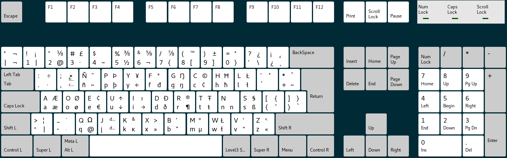

# latam-dvorak
### A Latin American Spanish Dvorak keyboard layout.

This this the new Latin American Spanish Dvorak layout:

Improvements:

* It's based on Latin American QWERTY keyboard
* There  are some  keyboards  with  additional symbols  and  now  it's easier  change  physical
  keys. Usually Q (@) and Ñ (~)
* Detailed lvl3 symbols.

## Installation on X.Org
I suggest to back up the `/usr/share/X11/xkb/symbols/latam` file. For example, in Ubuntu:

    sudo cp /usr/share/X11/xkb/symbols/latam /usr/share/X11/xkb/symbols/latam.bak

Copy the `latam` file to the  `/usr/share/X11/xkb/symbols` directory, or alternatively apply the
patch `01-dvorak-latam.patch`to the `/usr/share/X11/xkb/symbols/latam` file.

## Installation on console (now available in some distros by default)
Copy `dvorak-la.map.gz` on the dvorak keymaps directory (Usually `/usr/share/keymaps/i386/dvorak/`):

     sudo cp dvorak-la.map.gz /usr/share/keymaps/i386/dvorak/

Some distros use /etc/conf.d/keymaps to handle keyboard configuration. Edit it to configure your keyboard. 

     keymap="dvorak-la"

Or it is possible to set the keymap just for current session:

     loadkeys dvorak-la
